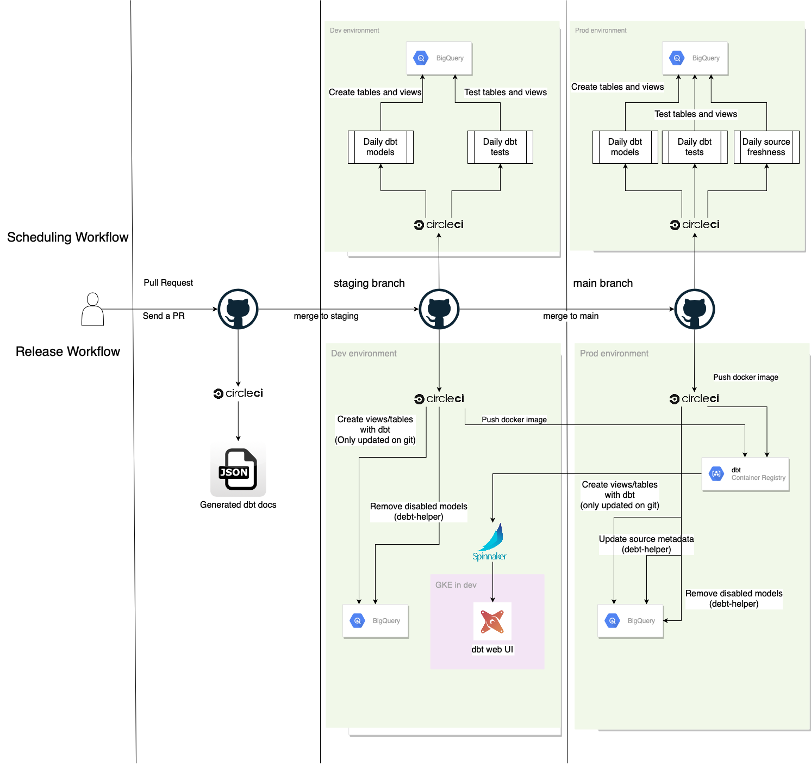

# CircleCI 

## Overview
There are three different behaviors by triggers with CircleCI.
1. Pull Request
2. Merge to staging
3. Merge to main

### Pull Request
One of the main focuses is to test generating dbt docs.
The metadata to generate dbt docs derives from BigQuery in production.

### Merge to staging
When we merge a pull request to main, we push docker images to google container registry in production.
A docker image with dbt contains generated dbt documentations with BigQuery metadata in production.

### Merge to main 
When we merge the staging branch to the main branch, we push docker images to google container registry in production.

## Registered environment variables on CircleCI
We manage environment variables on CircleCI.
.

Those are the significant environment variables to run the continuous integration.

- `GOOGLE_APPLICATION_CREDENTIALS_DBT_METADATA_PROD`: 
  - The credentials manages permissions to generate dbt documentations.
  - Service account email: `dbt-metadata@YOUR_PROJECT_PROD.iam.gserviceaccount.com`
- `GOOGLE_APPLICATION_CREDENTIALS_DBT_GCR_PROD`: 
  - The credentials manages permissions to push docker images to GCR in `YOUR_PROJECT_PROD`.
  - Service account email: `dbt-gcr@YOUR_PROJECT_PROD.iam.gserviceaccount.com`
- `GOOGLE_APPLICATION_CREDENTIALS_DBT_JOB_DEV`
  - The credentials manages permissions to run dbt jobs in `YOUR_PROJECT_DEV`.
  - Service account email: `dbt-job@YOUR_PROJECT_DEV.iam.gserviceaccount.com`
- `GOOGLE_APPLICATION_CREDENTIALS_DBT_JOB_PROD`
  - The credentials manages permissions to run dbt jobs in `YOUR_PROJECT_PROD`.
  - Service account email: `dbt-job@YOUR_PROJECT_PROD.iam.gserviceaccount.com`
- `SLACK_WEBHOOK`
  - It manages an incoming webhook of slack.

## FAQ

### How can we immediately schedule daily jobs in the production environment?
As a tentative solution, we can immediately schedule daily jobs by tagging `daily/.*`.

### Why do we use metadata of BigQuery in production, even on PRs and main?
There are two reasons.
First, it is annoying to maintain distributed permissions across GCP projects.
Second, I don't think we want to make sure the dbt web UI with BigQuery in development.
Rather than that, we probably want to check it with production metadata.
