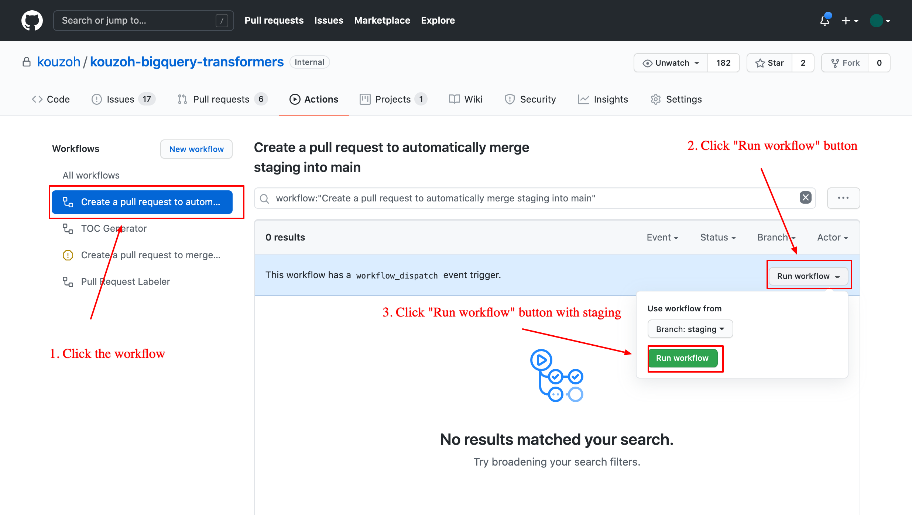

# Tips for Admins

<!-- START doctoc generated TOC please keep comment here to allow auto update -->
<!-- DON'T EDIT THIS SECTION, INSTEAD RE-RUN doctoc TO UPDATE -->

- [How to manually create a PR to merge staging into main](#how-to-manually-create-a-pr-to-merge-staging-into-main)
- [How to immediately run scheduled jobs in the production environment](#how-to-immediately-run-scheduled-jobs-in-the-production-environment)
- [How to create JSON credentials for the service accounts of GCP](#how-to-create-json-credentials-for-the-service-accounts-of-gcp)

<!-- END doctoc generated TOC please keep comment here to allow auto update -->

## How to manually create a PR to merge staging into main
We have a GitHub Actions workflow to create a pull request for merging the `staging` branch into the `main` branch.
That is "Create a pull request to automatically merge staging into main".
The workflow is mainly used to create PRs as a scheduled job.
But, we can manually trigger the workflow too.

Please note that the workflow doesn't create a pull request from the `staging` branch to the `main` branch.
Rather than that, it create the branch whose name is `merge-staging-into-main`.
So, even if we merge pull requests after triggering the workflow, the new changes are not applied to the `merge-staging-into-main` branch.

## How to immediately run scheduled jobs in the production environment
The CircleCI config has a workflow for daily jobs to immediately trigger `dbt run` with the `daily-prod` selector.
If we create a tag whose name matches with `daily-prod/.*`, the workflow is immediately triggered.

Moreover, we have a GitHub Actions workflow to create a git tag on the latest main branch at the time to triggering the github actions.
The name is "Create a git tag on the latest main branch".
The workflow is defined in [.github/workflows/git-tag-on-main](../../.github/workflows/git-tag-on-main.yml).

The rule can be applied to hourly, weekly and monthly jobs.

|GitHub tag       |dbt selector  |
|-----------------|--------------|
|`hourly-prod/.*` |`hourly-prod` |
|`daily-prod/.*`  |`daily-prod`  |
|`weekly-prod/.*` |`weekly-prod` |
|`monthly-prod/.*`|`monthly-prod`|

## How to create JSON credentials for the service accounts of GCP
If we have the permission, [./dev/create_gcp_service_accounts_json.sh](../../dev/create_gcp_service_accounts_json.sh) is the script to create JSON credential files of the service accounts.
