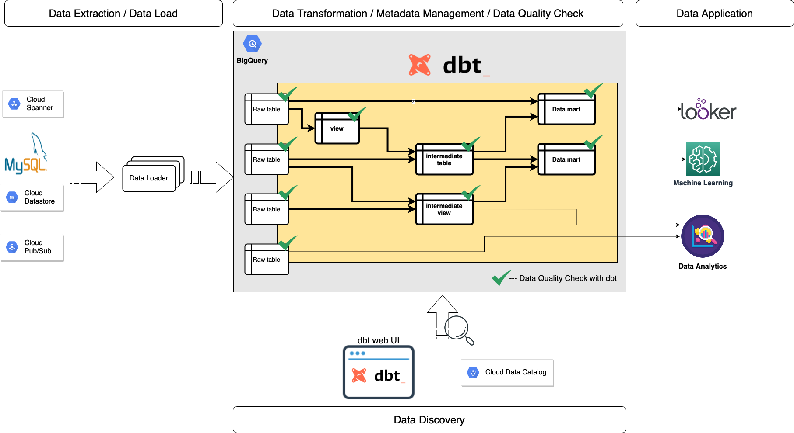

# Introduction to dbt
dbt version: 0.18.1

This documentation describes a high-level overview of dbt.
It would be helpful to briefly understand how to take advantage of dbt.
As well as, it describes `dbt-helper` which is a python-based command line tool in order to generate scaffold files for modeled BigQuery tables and views based on given information.

<!-- START doctoc generated TOC please keep comment here to allow auto update -->
<!-- DON'T EDIT THIS SECTION, INSTEAD RE-RUN doctoc TO UPDATE -->

- [What is dbt?](#what-is-dbt)
- [What dbt can do](#what-dbt-can-do)
- [What dbt can't do](#what-dbt-cant-do)
- [What is dbt-helper?](#what-is-dbt-helper)
- [How do we schedule jobs?](#how-do-we-schedule-jobs)
- [More advanced use of dbt](#more-advanced-use-of-dbt)

<!-- END doctoc generated TOC please keep comment here to allow auto update -->

## What is dbt?
dbt (data build tool) enables analytics engineers to transform data in their warehouses by simply writing select statements. dbt handles turning these select statements into tables and views.

dbt does the `T` in `ELT` (Extract, Load, Transform) processes – it doesn’t extract or load data, but it’s extremely good at transforming data that’s already loaded into your warehouse.

## What dbt can do
The yellow area is the main dbt roles.
dbt enables us to:
- model BigQuery tables and views only by SQL files with [dbt models](https://docs.getdbt.com/docs/building-a-dbt-project/building-models),
- test data quality of BigQuery tables and views by YAML files with [dbt tests](https://docs.getdbt.com/docs/building-a-dbt-project/tests),
- check data freshness of BigQuery tables and views by YAML with [dbt source snapshot-freshness](https://docs.getdbt.com/reference/commands/source) ,
- document metadata of BigQuery tables and views with YAML and markdown [dbt docs](https://docs.getdbt.com/docs/building-a-dbt-project/documentation/),
- search and discover BigQuery tables and views with [the dbt web UI](https://docs.getdbt.com/reference/commands/cmd-docs) and Cloud Data Catalog, and
- visualize dependencies of tables and views on the dbt web UI.

## What dbt can't do
The open-sourced dbt doesn't enable us to
- extract and load data from data sources,
- export BitQuery tables to Google Cloud Storage,
- schedule modeling tables and views,
- generate dbt resource files from existing tables and views, and
- write metadata to existing BigQuery tables.

## What is dbt-helper?
`dbt-helper` is a python-based custom command line tool.
The objective is to make us productive to develop dbt models and sources.
Because, we need comprehensive knowledge of dbt to configure dbt models and sources.
Plus, `dbt-helper` plays an important role to fill in the missing pieces which dbt can't do by default.

So, `dbt-helper` enables us to:
- generate scaffold files for a dbt model based on given information,
- generate scaffold files for dbt sources by using existing BigQuery tables,
- update dbt source YAML files with existing BigQuery tables, and 
- write metadata of BigQuery tables and dbt sources.

## How do we schedule jobs?
`dbt-helper` is not able to schedule jobs.
So, scheduling jobs is a big missing piece.
We use the CircleCI scheduled workflows tentatively at the time of writing the documentation.
In the near future, we plan to migrate them to Apache Airflow.

## More advanced use of dbt
If we get familiar with dbt more, we are able to:
- use community packages to leverage dbt with [dbt hub](https://hub.getdbt.com/),
- make incremental snapshots of BigQuery tables with [dbt snapshots](https://docs.getdbt.com/docs/building-a-dbt-project/snapshots),
- share BigQuery queries with [dbt analyses](https://docs.getdbt.com/docs/building-a-dbt-project/analyses/), and
- mange metadata of data consumers with [dbt exposure](https://docs.getdbt.com/reference/exposure-properties/).