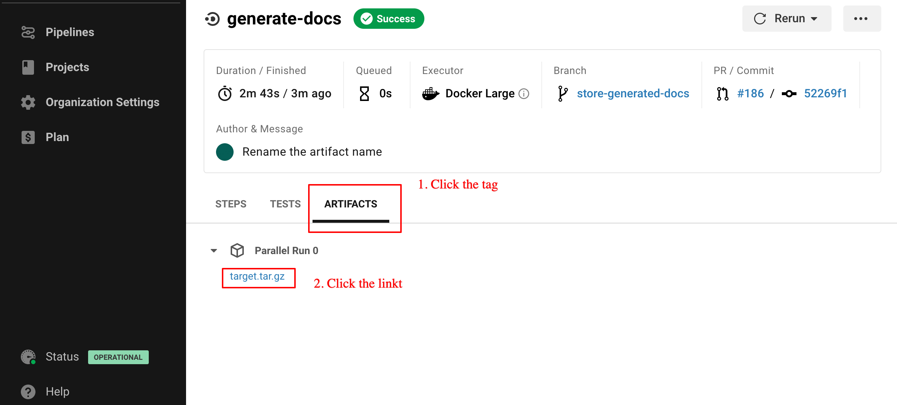

# Tips

<!-- START doctoc generated TOC please keep comment here to allow auto update -->
<!-- DON'T EDIT THIS SECTION, INSTEAD RE-RUN doctoc TO UPDATE -->

- [How to deal with a table which only exists in production](#how-to-deal-with-a-table-which-only-exists-in-production)
- [Download generated dbt documentation in a github pull request](#download-generated-dbt-documentation-in-a-github-pull-request)
- [How do we convert a view to a table and vice versa?](#how-do-we-convert-a-view-to-a-table-and-vice-versa)
- [How do we rebuild an incremental models?](#how-do-we-rebuild-an-incremental-models)

<!-- END doctoc generated TOC please keep comment here to allow auto update -->

## How to deal with a table which only exists in production
There are some tables which only exists in prod.
Indeed, we use variables to switch the development and production environments..
So, a fixed value can solve the problem.

For example, `DocomoShopSales` exists only in prod.
`sources.database` is equivalent to a GCP project.
So, we can fix `sources.database` with the GCP project in production.

```
 sources:
   - name: test_name
-    database: "{{ var('projects')['project-a'] }}"
+    database: "project-a-prod"
```

## Download generated dbt documentation in a github pull request
The CI stores the resulting generated dbt docs on CircleCI.
We can download `target.tar.gz` in the job of `generate-docs` on the UI.



```cd
# Change the directory to the dbt project.
$ cd path/to/your/dbt/project
# Remove the existing target directory.
$ rm -fr target
# Move the downloaded file to the dbt project
$ mv path/to/downloaded/target.tar.gz .
# Uncompress the file.
$ tar -zxvf target.tar.gz
# Launch the dbt web UI locally.
$ dbt docs serve
```

## How do we convert a view to a table and vice versa?
If we want to convert a view to a table by dbt, special operations are not required.
All we have to do is to change the materialization from `view` to `table`.

Meanwhie, if we want to convert a table to a view by dbt, we have to tun on `full_refresh` flag.
```sql
{{
  config(
    full_refresh=true,
  )
}}
```

* SEE: [full\_refresh \| docs\.getdbt\.com](https://docs.getdbt.com/reference/resource-configs/full_refresh/) 


## How do we rebuild an incremental models?
Please use `{{ config(full_refresh=true, ...) }}`.
* SEE: [full\_refresh \| docs\.getdbt\.com](https://docs.getdbt.com/reference/resource-configs/full_refresh/) 

One of the smoothest ways is the followings:
1. We create a pull request just to set `full_refresh=true`.
1. We merge the pull request into `staging`.
1. We make sure the CI on `staging` is succeeded.
1. We merge `staging` into `main`.
1. We make sure the CI on `main` is succeeded.
1. We create a pull request to revert the pull request created at the first step.
1. We merge the pull request into `staging`.
1. We make sure the CI on `staging` is succeeded.
1. We merge `staging` into `main`.
1. We make sure the CI on `main` is succeeded.
